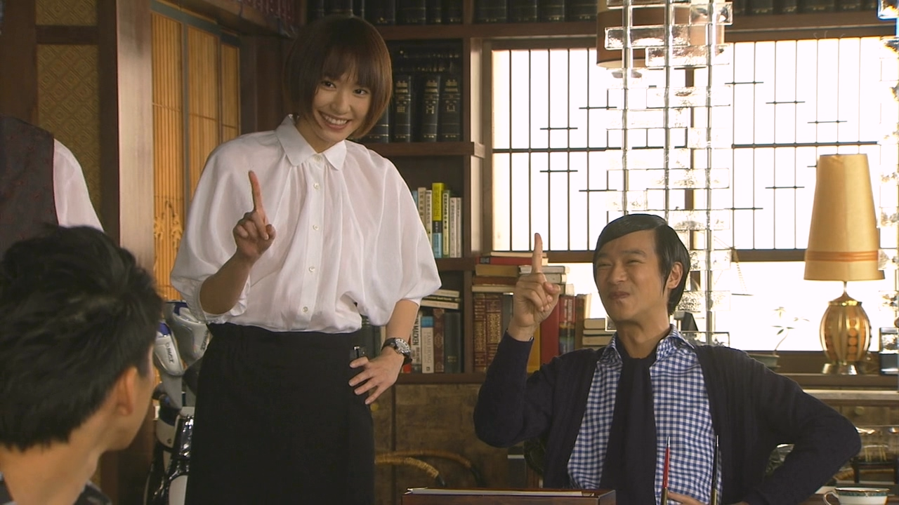
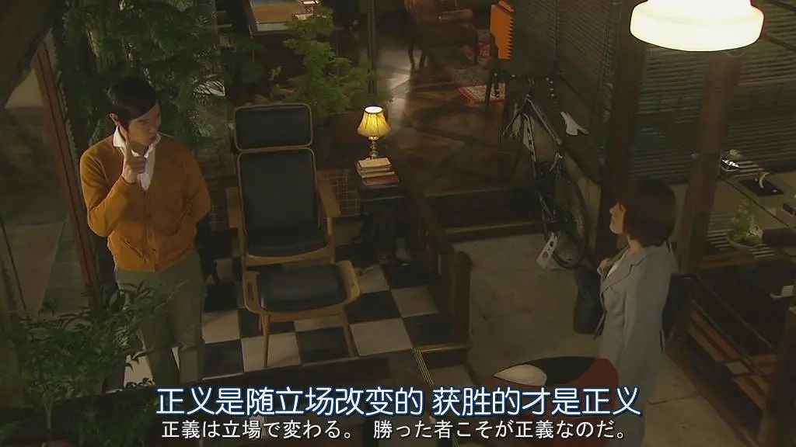

## Legal High (勝利級正義) 超赞
终于看完Legal High，一部豆瓣评分9.4的日剧，有些思绪，虽然大部分时间都在欣赏年轻时「新垣结衣」的颜了。
 
 

### 画面
由于比较古早，本剧摄于2012年，即12年前，新垣结衣尚还年轻，还在争论
终于得到女主的戏份，仿佛只能当一个花瓶，之后这部片子的第二部也使新垣结衣最终也荣获2014年的第79届日剧学院赏最佳女配角奖。

配色上古美门事务所中采用暖色系，阳光元素很多，故事直接发生在
客厅和阳台，事务员的小温室中种的蔬菜也有出现，显得十分温馨。
而对手三木则时常出现在冷色系中，显得阴郁，然而一切伏笔都在编剧
戏谑的揭示他们关系闹僵因为仓鼠而无厘头起来。

### 价值观
人之普遍理性诞生法律，而晨间剧女主般傻白甜的朴素正义写作莎士比亚的十四行诗——

神知道何为正义，身为人者只能恪守程序之正义，消除偏执。

每一集的末尾总有转折、暗示 击溃法庭上无罪辩护或有罪举证的闭环。蟹头村财产之争夺，结尾续写童年回忆，出现一只猴子偷走了儿时兄弟三人的苹果，暗示结局外人夺产，兄弟之争已成闹剧。然而留给观众的向来是结果，而非正义。

现实中留给我们的正义思来想去，去伪存真，又有多少是真正的正义。法庭宣判即为正义，虽有亵渎正义之嫌，实则是感性意义上的正义已经不适于基于理性的法治体系，不是古美门或gakki任何一方有错，而是程式化的正义压缩了为人上限和下限之间的距离，这两条线最终向法律底线看齐，无可厚非。
 

 
### 新垣结衣（gakki）赛高
不谈正义，直接当新垣结衣出演的喜剧来看本剧就已足够，gakki执着在败诉的泥沼中，突然反应过来什么总是高兴的过头，然后被古美门点破嘲笑又露出生气的表情，笑点很多也很kawai，每集一个案件也使得剧情十分紧凑，比某些国产剧天天凑剧情来的好。

### 总结
总之，感谢阅读至此，推荐观看。

以上。