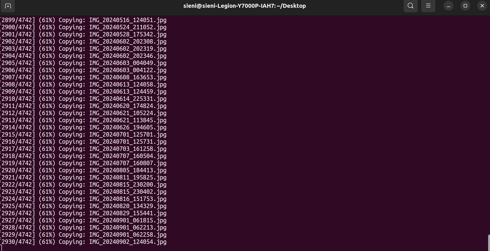

## 问题描述
已知手机和电脑用的是 USB3.0 的数据线连接，读写速度至少也应该是 5MB/s, 即受限于手机内存的读写速度限制。

然后博主昨天在 Windows11 从备份往回写 60GB 的备份照片的时候就觉得很慢，耗时五小时还有一半没有传完，于是拔掉数据线走人。

第二天再传，想着 Windows 反正能够选择跳过所有重名文件，直接断点续传就行，但是没想到只要选择跳过所有，整个传输进程就会被卡退。

## 为什么呢？试试 Linux！
起初以为是 Windows 的 BUG, 那就换 Ubuntu 来复制呗，反正双系统，哪个行上哪个.... 结果坏了，Ubuntu 没有 kill 掉我的传输进程，而是直接整个卡死，断点重启后，`/dev/nvme0n1p6` 还出现脏位，boot 失败进了 emergency terminal.

后来一想，想来手机的文件系统挂载在 Linux 上肯定是比较脆弱的，估计这么多照片文件没有合适的索引来查询，导致比对重名文件的时候直接跑满 CPU 爆掉了。

## 那就手动提取
其实也不用索引，本身文件名在没有特殊字符的时候就是可以有序排列的，那我们写一个脚本，将 source folder 和 target fodler 中的文件列出来，各自排好序，比对出缺少的文件，再循环 `cp` 他们不就行了？

```
#!/bin/bash

SOURCE_DIR="/media/sieni/Extra_Data/pivot_backup/Photos-ONP10P/2025.12.25/DCIM/Camera"
TARGET_DIR="/run/user/1000/gvfs/gphoto2:host=OnePlus_WAIPIO-MTP__SN%3A60D8788C_60d8788c/DCIM/Camera"
OUTPUT_TXT="/media/sieni/Extra_Data/pivot_backup/Photos-ONP10P/2025.12.25/missing_files.txt"

TMP_SOURCE_LIST="/tmp/source_files.txt"
TMP_TARGET_LIST="/tmp/target_files.txt"

# List filenames in source directory
ls "$SOURCE_DIR" | sort > "$TMP_SOURCE_LIST"

# List filenames in target directory
ls "$TARGET_DIR" | sort > "$TMP_TARGET_LIST"

# Find files that are in source but not in target
comm -23 "$TMP_SOURCE_LIST" "$TMP_TARGET_LIST" > "$OUTPUT_TXT"

TOTAL_FILES=$(wc -l < "$OUTPUT_TXT")
CURRENT=0

echo "Total files to copy: $TOTAL_FILES"

while read -r filename; do
    CURRENT=$((CURRENT + 1))
    PERCENT=$((CURRENT * 100 / TOTAL_FILES))

    echo "[$CURRENT/$TOTAL_FILES] ($PERCENT%) Copying: $filename"

    cp "$SOURCE_DIR/$filename" "$TARGET_DIR/"

done < "$OUTPUT_TXT"

# Clean up temporary files
rm "$TMP_SOURCE_LIST" "$TMP_TARGET_LIST"

echo "Finished copying missing files."
```

成功了，完美将手机存储上的负担降到最轻，一次 `ls` 就弄清缺少的文件，接下来都是单线程逐个 `cp`.

<center></center>