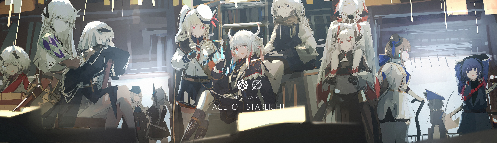

 <blockquote> 一直想创建一个独属于我的在线资产(Online assets) </blockquote> 

所以就酱紫付诸实现了，感谢诸位浏览本站，并有兴趣点进我的About 。

 <h3> 关于本站</h3>

小站寒酸，杂谈琐事，分享知识

旅行的照片会配上文字

如今网络繁杂，观点纷纭，借此机会开辟属于自己的场所

网站由台湾同胞的 **Hexo & fluid-theme** 驱动

在此基础上小有改动

全站托管在 **Netlify** 平台

国内CDN加速采用 **Cloudflare** 的方案

<h3> 关于本人</h3>

武汉大学大二学生

专业计算机科学（Computer Sience）

主要实用语言 CPP、python、html、<del>English</del>

<b>初步理解</b>

电脑开关机（这个是唯一完全掌握的）

<del>数据结构及算法（Data structure and algorithm），基于QT6的图形化界面 </del>

<del>机器学习（Machine learning）、深度学习（Deep learning）

<del>数据库使用，网页制作 

……

大多数的内容还在学习中

英文的东西还是难啃

很喜欢百合，女孩子贴贴就是好

>女儿是水作的骨肉，男人是泥作的骨肉。我见了女儿，我便清爽；见了男子，便觉浊臭逼人。 
> 
> --贾宝玉《红楼梦》

可能直接上图比较有说服力

爱好 **摄影、足球、羽毛球 ……**

热情的ENTP看到什么新的都想要尝试，所以以上就打省略号了

<h3> 个人信息 </h3>

E-mail：worldsieni@protonmail.com

QQ:2498974359 （欢迎来交朋友）

Github：AI-Kyo-er

其他的社交媒体要么不常用，要么不适合贴在这里欧

结尾啦，拜拜